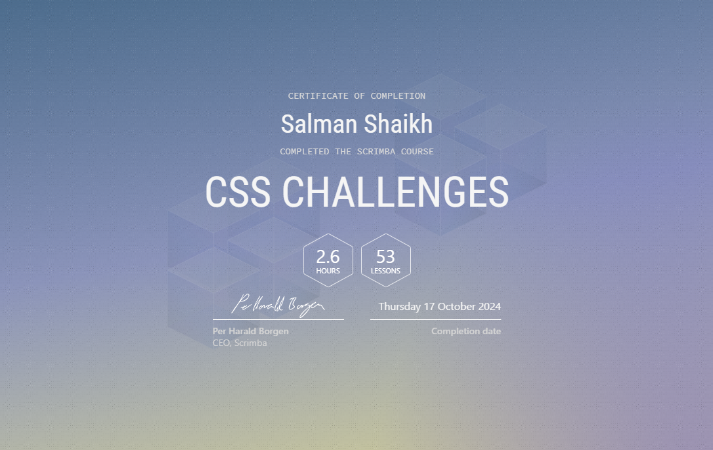

#  CSS-Challenge by Scrimba.com

## Table of contents

- [Overview](#overview)
 
  - [Screenshot](#screenshot)
  - [Links](#links)
  - [Built with](#built-with)
  - [What I learned](#what-i-learned)

  - [Author](#author)

## Overview

### Certificate

### Links

- Live Site URL: [Add live site URL here](https://salmanshaikh-dev.github.io/Pulse-CashFlow/)

### Built with

- Semantic HTML5 markup
- CSS custom properties
- Flexbox
- CSS Grid

### What I learned
 - In this Repository - I learned how to create components and layouts from popular applications like GitHub, CodePen, and Instagram. I'm also building loading animations, progress bars, flashcards, and more using pure CSS!

## Author

- Website - [Salman Shaikh](https://github.com/salmanshaikh-dev)
- Frontend Mentor - [@git-salmanshaikh](https://www.frontendmentor.io/profile/git-salmanshaikh)
- Twitter - [@yourusername](https://www.twitter.com/sam_98k)
